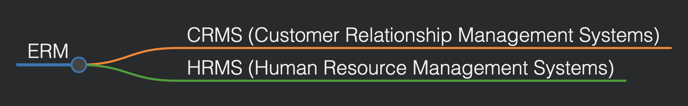
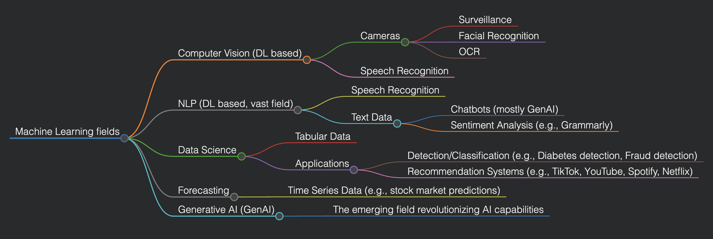
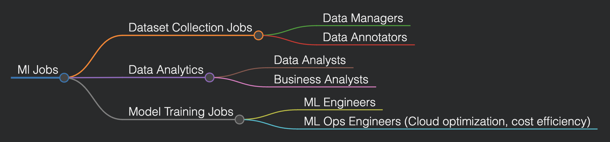
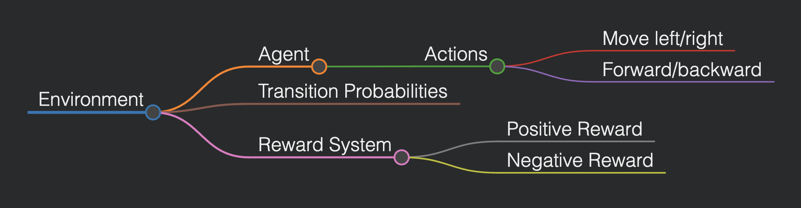
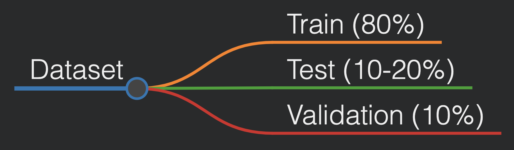
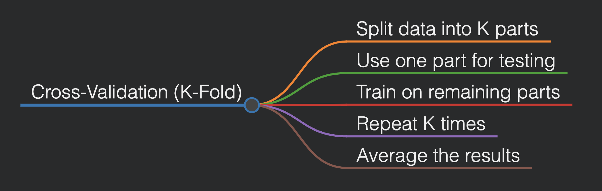

# Machine Learning (CSE445)

## Lecture 3 (Date: 23/01/25)

### Revision on ML Pipeline

- Review of the ML pipeline.
- Understanding T (Task), E (Experience), and P (Performance).

### Enterprise Management Systems (ERMs)

In industries, Enterprise Resource Management Systems (ERMs) are widely used.

AI agents may be incorporated into these systems, enabling them to interact, learn, and adapt features without requiring software engineers to code them manually.

### AI/ML Problems and Model Use Cases

Different types of AI/ML problems can be defined based on the type of data they process:

**Note:** Tools such as Roboflow can be used for data annotation.

### AI Pipeline Job Roles

### ML System Categories

1. **Supervised Learning:**
   - Based on labeled data: `X` (input features), `Y` (output/labels).
   - Examples:
     - Regression (Linear Regression, Logistic Regression)
     - Classification
   - Data split into train/test (e.g., 80/20).

2. **Semi-Supervised Learning:**
   - Combination of supervised and unsupervised learning.
   - Example: Google Photos (initial clustering, then human labeling).

3. **Unsupervised Learning:**
   - Finds patterns without specific tasks.
   - Clustering and pattern recognition.

---

## Lecture 4 (Date: 25/01/25)

### Reinforcement Learning (RL)

Reinforcement Learning (RL) differs from the previous types, as it does not use labeled/unlabeled data. Instead, it involves an agent in a fixed environment:

#### Bellman’s Equation

Bellman's equation is a fundamental recursive formula used to determine the optimal policy in reinforcement learning by breaking down the decision-making process into smaller sub-problems. It expresses the value of a particular state as the sum of the immediate reward and the discounted future reward.

**Formula:**

\[
V(s) = \max_{a} \left[ R(s, a) + \gamma \sum_{s'} P(s' | s, a) V(s') \right]
\]

**Where:**
- \( V(s) \): Value of state \( s \).
- \( R(s, a) \): Reward received after taking action \( a \) in state \( s \).
- \( \gamma \): Discount factor (0 < \( \gamma \) < 1).
- \( P(s' | s, a) \): Probability of moving to state \( s' \) from state \( s \) when action \( a \) is taken.

---

### Dataset Splitting

#### Explanation:
- **Train Set:** Used to train the model.
- **Test Set:** Evaluates the model's performance.
- **Validation Set:** Used in deep learning to tune the model during training.

---

### Model Evaluation Metrics

- **Training Accuracy:** Measures how well the model performs on the training data.
- **Testing Accuracy:** Measures performance on unseen data.
- **Validation Accuracy:** Helps prevent overfitting during training.

#### Issues in Model Evaluation:

- **Overfitting:** High training accuracy, low testing accuracy (e.g., 90% vs 55%).
- **Underfitting:** Both training and testing accuracies are low.

---

### Cross-Validation

Cross-validation is used for small datasets. The dataset is divided into K equal parts:

Example:
- For a dataset of 500 samples with `K=5`, each fold contains 100 samples.

<image src="./kcrossvalidation.png" />

---